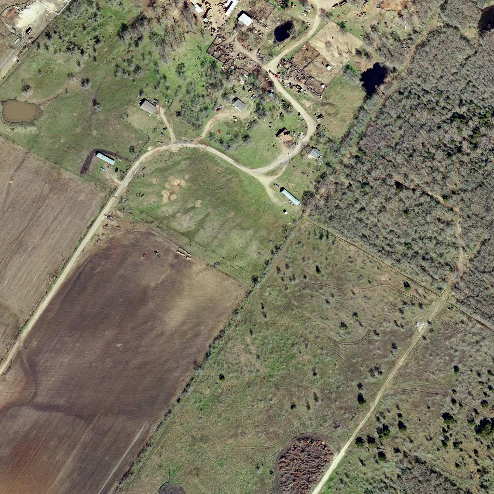
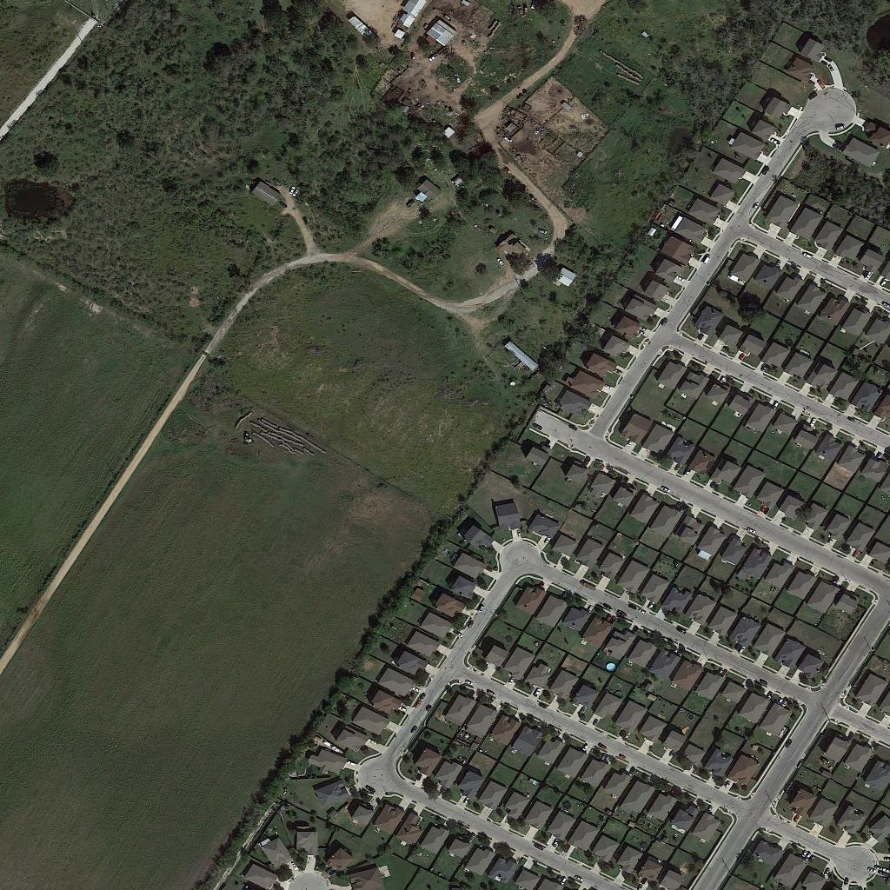
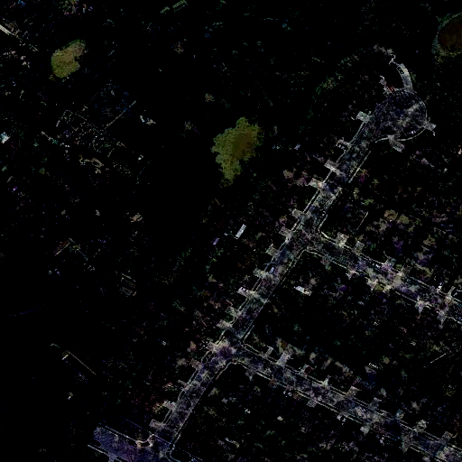
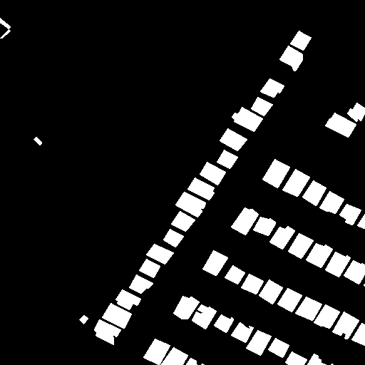
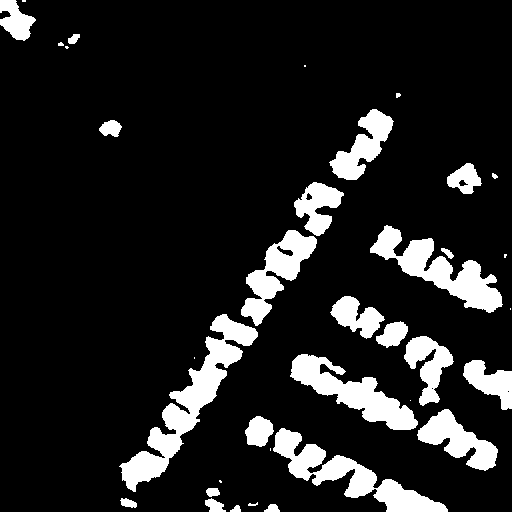

# Remote_Building_Change

## 1 Data
本项目使用[LEVIR数据](https://justchenhao.github.io/LEVIR/),使用data.py文件中process_data()类可将原数据分割成512*512大小的小图像,并剔除空白变化影像。

## 2 Train
数据处理完成后，可直接运行train.py文件，开始模型训练。

## 3 Test
训练完成后，可运行test.py文件测试训练结果。


## 4 Requirements 
```
python 3.7
pytorch
numpy
opencv
PIL
```

## 5 Result
下面展示了不同时期的两幅影像A、B、它们之间差值、建筑物变化的标签图、模型预测结果。\




